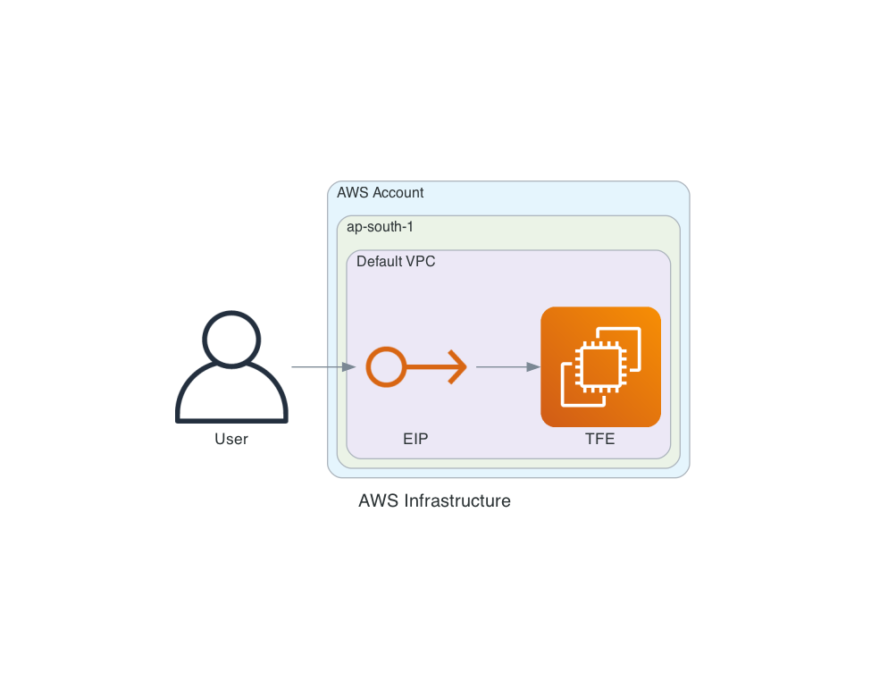

# Terraform Infrastructure Code

This repository contains Terraform code to deploy the following infrastructure on AWS:


- 1 Security Groups
- 1 EC2 instance
- 1 Key.pem

## Prerequisites

Before deploying this infrastructure, you will need:

- An AWS account with permissions to create the above resources
- Authentication/Access and Secret Access Key to AWS Account
- Terraform CLI installed on your local machine

## Usage

To deploy the infrastructure, follow these steps:

- Clone this repository to your local machine.
- Run `terraform init` to initialize the Terraform configuration.
- Run `terraform plan` to generate an execution plan.
- If the execution plan looks good, run `terraform apply` to apply the changes to your AWS account.

## Diagram for the Infrastucture Created


- How to create the diagram

```
Install python
Install Graphviz
Install Diagrams
cd to diagram folder on this repo
python main.py
```

## Connect to the instance

- grab command to connect to instance

```
terraform output ssh_public_ip
```

## Cleaning up
To delete the infrastructure, run `terraform destroy` from the `terraform` directory.

## License
This code is licensed under the MIT License. See the `LICENSE` file for details.
